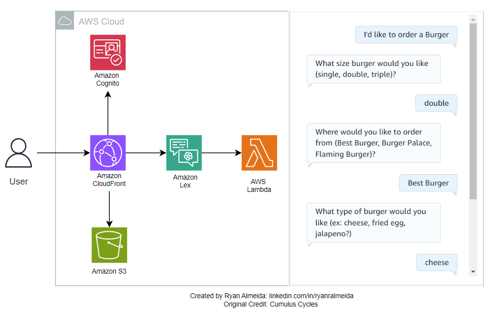

# Build a Food Order Chatbot using AWS 

## Project Description:
This project builds and interact with a chatbot that allows you to place a food order. This is an example built by combining two online tutorials:
- A Youtube Tutorial that shows how to build the actual chatbot using Amazon Lex
- A Cloudformation tutorial/repo that allows you to provision a UI component (a web browser in this case) within which to embed a chatbot (such as the one above)

This project serves as an introductory exploration to building conversational AI. 

## Architecture Diagram and Output:

## Components Decription:
| Component     | Functionality |
| ------------- | ------------- |
| Amazon Lex      | Provides the chatbot functionality, allowing users to interact with th system via voice or text. Handles natural language processing to understand user input and respond accordingly |
| AWS Lambda | Executes backend logic. It uses the built-in integration capability with Lex to process inputs from Lex (e.g. parsing user orders, validating data, handling business and fulfilment logic) and returns responses |
| Amazon S3  | Hosts the static assets (such as HTML, CSS and JavaScript files) for the frontend webpage where the Lex chatbot is embedded  |
| AWS Cloudfront  | Distributes the frontend webpage content via a Content Delivery Network (CDN), ensuring fast and secure delivery of the website globally |
| Amazon Cognito  | Handles user authentication for the frontend, providing secure access to the web interface for users interacting with the chatbot  |

## Features:
This chatbot allows you to order and customize a burger with the following characteristics:
- Order a Burger from 3 different Franchises
- Each Franchise has 3 unique toppings
- Order a Burger in 3 different sizes
- Choose from a selection of sides and drinks
- The Chatbot enforces the above logic (i.e. if you select an incorrect topping from a respective Franchise, the bot will automatically prompt you with an error message)

## Learning Outcomes:
- Building this chatbot exposes you to a simple but effective introduction towards designing and building conversational AI. Amazon Lex allows you to easily add AI that understands intent, maintains context, and build the chat interface without worrying about hardware or infrastructure. Using Lex also provides you with hands-on experience with designing conversational AI and understanding how natural language processing can improve user engagement. 
- AWS Lambda allows you to efficiently execute the backend logic without the need to provision any infrastructure. Its built-in integration capabilities with Lex also allows you to appreciate such pre-existing functionality in AWS.
- Using Amazon S3 and CloudFront allows you to create a user-friendly web interface, and expose you to basic web hosting, content delivery and website optimization practices.
- Amazon Cognito introduces you to managing secure user authentication flows, enhancing the security of the project's frontend.
- Overall this project is a great introduction to AWS's ecosystem surrounding conversational chatbots and serverless computing, allowing to you to develop a skill set with practical use cases in industry. 

